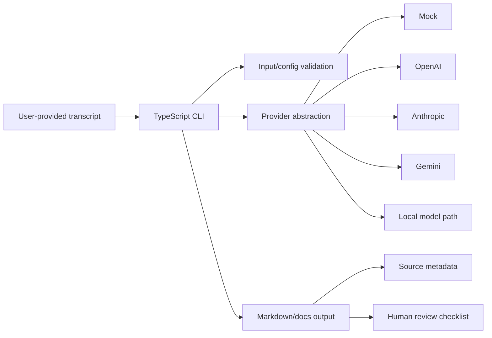

# Architecture Review — devdocs-forge-agent

`devdocs-forge-agent` is a secondary product proof showing **provider abstraction, local-first AI workflow design, structured outputs and human review**.

## System flow

## Architecture strengths

- source ingestion is user-supplied rather than hidden scraping
- provider selection is isolated behind an abstraction
- mock mode enables deterministic local review without credentials
- generated content is packaged with metadata and a review checklist
- Markdown-first output integrates with version-controlled documentation systems

## Trust boundary

Generated documentation is a draft. Provider output must not be treated as verified technical truth merely because it is formatted well. Attribution and human review are part of the workflow contract.

## Failure/recovery concerns

- invalid transcript/config should fail before provider execution
- missing provider credentials should identify the required configuration
- provider failure should preserve source inputs and allow retry
- partial output should not be silently presented as complete
- validation should catch missing required output artifacts

## Portfolio role

This project demonstrates a focused AI developer-tool architecture. It supports the broader architect narrative without competing with the flagship frontend/control-plane repositories.
